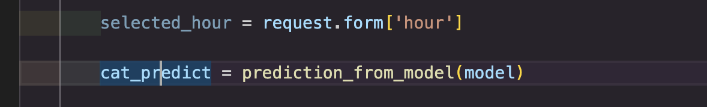
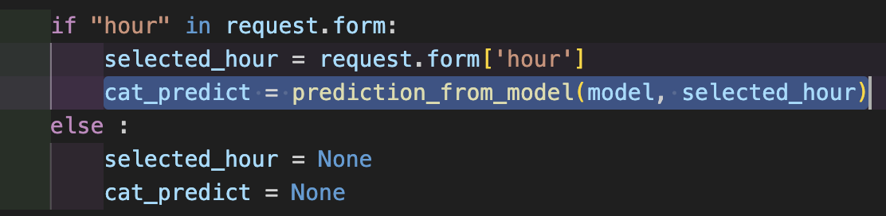
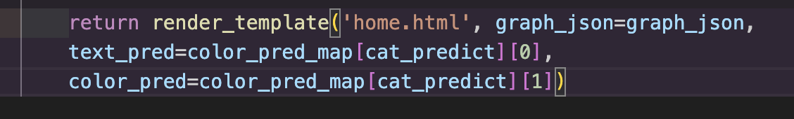
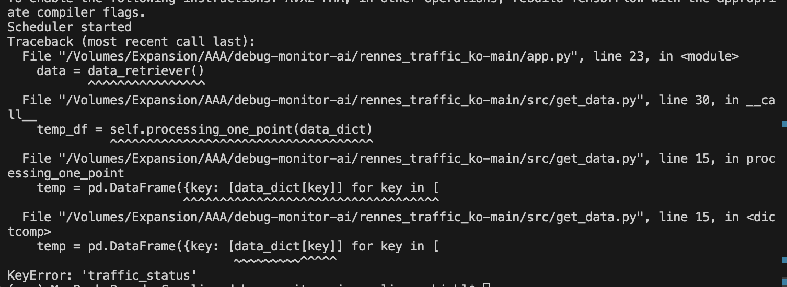

Application web en utilisant Flask. Permet à l'utilisateur de voir des données sur le trafic en temps réel et d'obtenir des prédictions sur les conditions de trafic basées sur un modèle de machine learning.
- app.py est le fichier principal qui configure les routes et la logique de traitement des requêtes, 
- get_data.py sert à la récupération des données de trafic depuis une api
- utils.py sert à la création des graphiques et aux prédictions du modèle.

# Mise en place de l'environnement virtuel
python3 -m venv env
source env/bin/activate

# Mise en place git hub
Créer le .gitignore
remote : https://github.com/carozum/debug-monitor-apps.git

Erreur A résoudre : 
git push origin main
Énumération des objets: 40, fait.
Décompte des objets: 100% (40/40), fait.
Compression par delta en utilisant jusqu'à 4 fils d'exécution
Compression des objets: 100% (39/39), fait.
erreur : échec RPC ; HTTP 400 curl 22 The requested URL returned error: 400
send-pack: unexpected disconnect while reading sideband packet
Écriture des objets: 100% (40/40), 101.22 Mio | 10.91 Mio/s, fait.
Total 40 (delta 5), réutilisés 0 (delta 0), réutilisés du pack 0
fatal : l'hôte distant a fermé la connexion de manière inattendue
Everything up-to-date

# correction d'erreurs

### erreurs de syntaxe : 
- indentation après le for dans get_data.py ligne 30 et 31
- ] non fermé get-data.py ligne 34
- , manquante ligne 17 dans utils.py
- dans app.py ligne 52 oubli des parenthèses après to_json()

### Correction erreur d'import de package - installation des packages
Ajout requirements.txt
Ajout des packages utiles : 
- pip install tensorflow : pour installer keras
- pip install flask
- pip install pandas
- pip install plotly

### packages inutiles
Suppression des packages inutilisés dans app.py : plotly, numpy

### Absence de gestion des erreurs de formulaire 
On suppose que le champ hour contient une valeur. Il faut envisager le cas où pas de valeur pour hour sinon cela déclenchera une erreur. (méthode POST). --> erreur de validation des données formulaire.

Dans le cas où pas d'heure, traiter l'appel il risque d'y avoir une erreur : color_pred_map[cat_predict][0] et color_pred_map[cat_predict][1]. 

Cela veut dire qu'il faut que text_pred et color_pred ait des valeurs par défaut. IL faut les initialiser

### Erreur d'appel de la fonction : oublie du paramètre heure
Il faut l'ajouter. 
cat_predict = prediction_from_model(model, selected_hour)

### erreur dans les clés 
 
dans get_data.pyl igne 15

